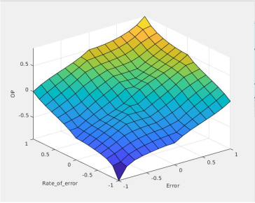

**GITHUB Link - https://github.com/Akshit-Patel/Control-System-Projects**

This repository contains some common problems to control systems and their MATLAB SIMULINK solutions.

**Problem 1 - Closed Loop PID speed control for mathematical model of BLDC Motor**

This is a starter problem in which a basic mathematical model of BLDC motor is designed and controlled via PID. Same controller is designed with both MATLAB and SIMULINK

Resources - 

* Four Video Series of SIMULINK Basics by MATLB
    * https://www.youtube.com/watch?v=iOmqgewj5XI&feature=emb_title

**Problem 2 - Normal PID, Self Tuning Fuzzy PID and PID with Genetic Algorithm for Angle Control of Inverted Pendulum**

<!--  -->

An inverted pendulum is a pendulum that has its center of mass above its pivot point. It is unstable and without additional help will fall over. It can be suspended stably in this inverted position by using a control system to monitor the angle of the pole and move the pivot point horizontally back under the center of mass when it starts to fall over, keeping it balanced. The inverted pendulum is a classic problem in dynamics and control theory and is used as a benchmark for testing control strategies. 

Resources -

   * Understanding Basics of Fuzzy System
     *  https://www.youtube.com/watch?v=OVINlUaEiS8&list=PLk8_UfafEClpL0r1YaYHz-F1AbGJDQizL 
  * Genetic Algorithm
     *  https://www.youtube.com/watch?v=ZF004x8kd08&feature=youtu.be
  * Inverted Pendulum
     *  http://ctms.engin.umich.edu/CTMS/index.php?example=Introduction&section=SystemModeling

**Problem 2 b - Sub part only normal PID control of inverted Pendulum**

Basic Version of the above problem and only normal PID Control

**Problem 3 - Tune a proportional controller using root locus for a generalized second order system to have a specific settling time and maximum overshoot for step reference input**
Resources -

   * Understanding Root Locus
     * https://ctms.engin.umich.edu/CTMS/index.php?example=Introduction&section=ControlRootLocus

**Problem 4 - Self Tuning based Fuzzy logic-based control of speed and position of DC shunt motor.**

